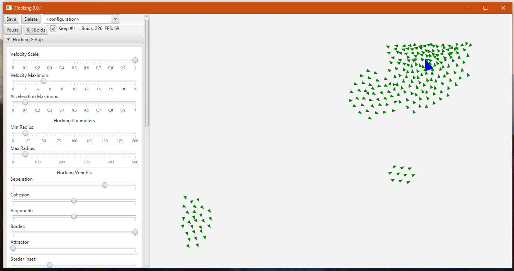
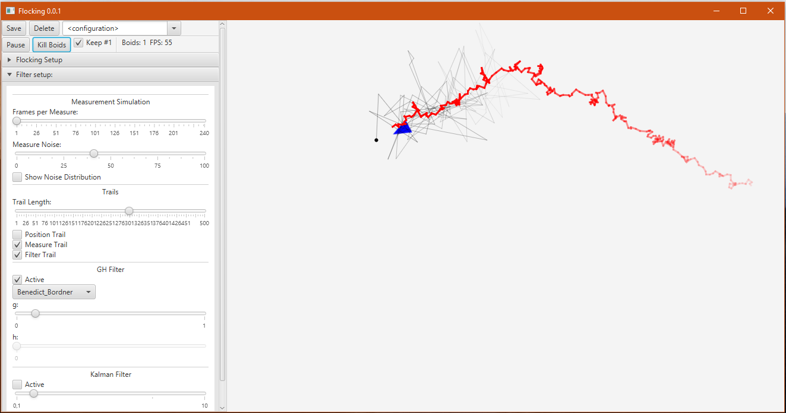
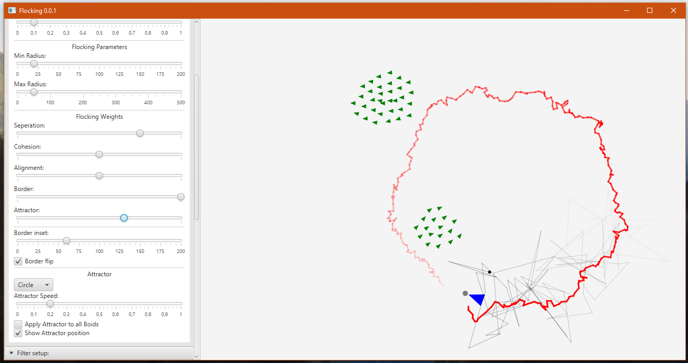

# Flocking

[Download latest executable version](http://michaelhochmuth.de/code/flocking/Flocking-0.0.1.zip)

## Overview

The Flocking project is a simple Java application running a [Flocking](https://en.wikipedia.org/wiki/Flocking_(behavior)) simulation.

Any number of **boids** can be added easily by dragging with the mouse. They will then interact with each other and otherwise behave floating with constant velocity (no friction yet).
The interaction is governed by different **behaviours** (*cohesion*, *seperation*, *alignment*, *border-avoidance*, following an *attractor*) added onto each other.

### Measurement and Filtering

The first Boid is marked as special. The app incorporates a mechanism for simulating periodic and noisy measurements of this boid's position and then trying to filter the noise back out with different filters. Currently a [G-H Filer](https://en.wikipedia.org/wiki/Alpha_beta_filter)) and a simple [Kalman Filter](https://en.wikipedia.org/wiki/Kalman_filter) are included. The progression of the boids real position, the "measured" position and the filtered position can each be visualized with trail-renderers.

### Attractors

Also the first boid may follow one of three possible **Attractors**, defined as 2-dimensional curves (circle, line, eight), to further show the effect of the filtering.

## Current State

I developed this project for a university course to explore and visualize g-h and Kalman-filtering. I don't plan to develop it further anytime soon, but if you are interested in this software, and maybe want to use it somewhere (education perhabs) or contribute, feel free to contact me!